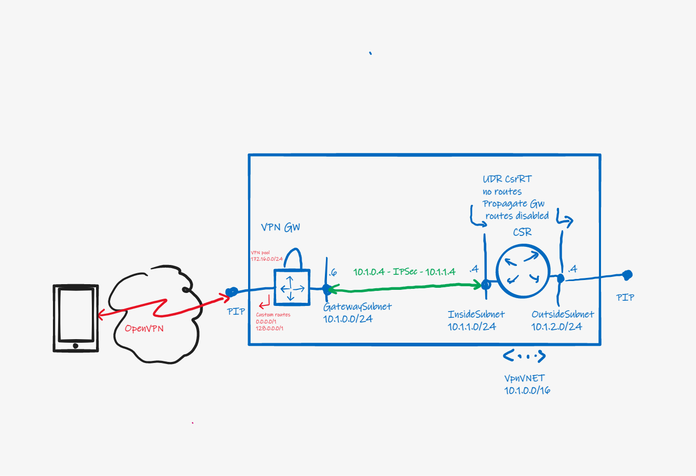

# **Point-to-site VPN Internet Gateway**

# Introduction
User remote access VPN solutions usually implement split tunnel. Internet traffic breaks out at the client directly, and only traffic for the internal network is sent up the tunnel to the network hub. 

There are scenario's where internet traffic needs to the forced up the tunnel as well, to break out at the network hub. Think of:
- Securing internet access when using public wifi access points.
- Requirement to filter and scan internet access at a central firewall and proxy.
- Hide or anonymize the user's public ip address.
- Geographically move the user's public ip address, for instance to access services not available at the user's location.

This article describes a remote access internet gateway in Azure, and provides a reference implementation in Bicep.

# Architecture
The solution consists of a VNET containing a VNET Gateway with a Point-to-site configuration, and a Network Virtual Appliance (NVA). The NVA in the reference implementation is a Cisco CSR1000v router.

The Gateway in the reference implementation is configured for the OpenVPN tunnel protocol with certificate authentication, as this works well with the OpenVPN client for iOS and Android. The solution will also work with IKEv2/IPSec.

The Gateway advertises a default route to connected remote devices, causing devices to send internet traffic into the tunnel. This default route is set through the [Custom routes feature](https://docs.microsoft.com/en-us/azure/vpn-gateway/vpn-gateway-p2s-advertise-custom-routes),  which is not available through the Azure portal.

The NVA is needed because the Gateway itself does not provide a [direct route to the internet](https://docs.microsoft.com/en-us/azure/vpn-gateway/vpn-gateway-p2s-advertise-custom-routes#forced-tunneling). 


# Routing
Traffic arriving at the Gateway must be forced to the NVA, which provides a path to the internet through its Public IP. 

However, simply placing a User Defined Route on the GatewaySubnet, with a default route to the NVA, will not work. Reason is that the tunnels to the remote clients also originate from the GatewaySubnet. A UDR forces tunnel traffic through the NVA causing the tunnel to break.

The solution is to send the user traffic through a Site-to-site IPSec tunnel between the Gatway and the NVA. The Site-to-site tunnel originates from the Gateway's [private IP address](https://docs.microsoft.com/en-us/azure/vpn-gateway/site-to-site-vpn-private-peering#portal). A Local Network Gateway statically configured with split default routes (0.0.0.0/1 and 128.0.0.0/1, LNG does not support 0.0.0.0/0) represents the NVA. This forces all remote user traffic arriving at the Gateway into the tunnel to the NVA.

This configuration causes the Gateway to program routes for 0.0.0.0/1, 128.0.0.0/1 and the VPN Pool pointing to itself on the NVA's InsideSubnet and OutsideSubnet, breaking the tunnel. A User Defined Route with the "Propagate gateway routes" property set to No prevents the Gateway from setting these routes on the InsideSubnet and OutsideSubnet.

# Deploy
Log in to Azure Cloud Shell at https://shell.azure.com/ and select Bash.

Ensure Azure CLI and extensions are up to date:
  
      az upgrade --yes
  
If necessary select your target subscription:
  
      az account set --subscription <Name or ID of subscription>
  
Clone the  GitHub repository:

        git clone https://github.com/mddazure/p2s-vpn-internet-gateway

Change directory:
  
      cd ./p2s-vpn-internet-gateway

Accept the terms for the CSR1000v Marketplace offer:

      az vm image terms accept --urn cisco:cisco-csr-1000v:16_12_5-byol:latest

Deploy the Bicep template:

      az deployment sub create --location <location> --template-file templates/main.bicep

Verify that all components in the diagram above have been deployed to the resourcegroup `p2s-vpn-gw` and are healthy.

# Configure
## CSR1000v NVA
The CSR1000v NVA is up but must still be configured.

Log in to the CSR1000v via the Serial console in the portal, as this does not rely on network connectivity in the VNET.

Credentials:

username: `AzureAdmin`

password: `P2SvpnGW-2021`

Serial console is under Support + troubleshooting in the Virtual Machine blade.

Enter Enable mode by typing `en` at the prompt, then enter Configuration mode by typing `conf t`.

Paste in below configuration:

```
crypto ikev2 proposal azure-proposal-connectionP2SGW
 encryption aes-cbc-256 aes-cbc-128
 integrity sha1 sha256
 group 2
!
crypto ikev2 policy azure-policy-connectionP2SGW
 proposal azure-proposal-connectionP2SGW
!
crypto ikev2 keyring azure-keyring
 peer 10.1.0.4
  address 10.1.0.4
  pre-shared-key P2S2021
!
crypto ikev2 profile azure-profile-connectionP2SGW
 match address local interface GigabitEthernet1
 match identity remote address 10.1.0.4 255.255.255.255
 authentication remote pre-share
 authentication local pre-share
 keyring local azure-keyring
 lifetime 28800
 dpd 10 5 on-demand
!
crypto ipsec transform-set azure-ipsec-proposal-set esp-aes 256 esp-sha256-hmac
 mode tunnel
!
crypto ipsec profile azure-ipsec-p2s
 set security-association lifetime kilobytes 102400000
 set transform-set azure-ipsec-proposal-set
 set ikev2-profile azure-profile-connectionP2SGW
!
interface Tunnel101
 ip address 10.0.100.4 255.255.255.254
 ip nat inside
 ip tcp adjust-mss 1350
 tunnel source GigabitEthernet1
 tunnel mode ipsec ipv4
 tunnel destination 10.1.0.4
 tunnel protection ipsec profile azure-ipsec-p2s
!
interface GigabitEthernet1
 ip address dhcp
 ip nat inside
 negotiation auto
 no mop enabled
 no mop sysid
!
interface GigabitEthernet2
 ip address dhcp
 ip nat outside
 negotiation auto
 no mop enabled
 no mop sysid
!
ip nat pool natpool 10.1.2.4 10.1.2.4 netmask 255.255.255.252
ip nat inside source list 1 pool natpool overload
ip nat inside source list GS_NAT_ACL interface GigabitEthernet1 vrf GS overload
ip route 0.0.0.0 0.0.0.0 GigabitEthernet2 10.1.2.1
ip route 10.1.0.0 255.255.255.0 GigabitEthernet1 10.1.1.1
ip route 172.16.0.0 255.255.255.0 Tunnel101
!
ip access-list standard 1
 10 permit 172.16.0.0 0.0.0.255  
```
Type `exit` twice to leave Config mode, returning to the # prompt.

Type `show ip int brief` and verify interface Tunnel101 shows `up` for both Status and Protocol. This means that the site-to-site tunnel to the Gateway is established. It may take a few minutes for the connection status to show Connected in the Azure portal.

## Client
### iOS and Android devices
Install the OpenVPN client on your device, this is available free of charge from the Appstore.

The VPN client package downloadable from the Azure portal contains a template configuration file for the OpenVPN client. The client certificate and private key need to be inserted and then the file must be loaded into the OpenVPN client on the remote device.

Follow these steps:

#### On your pc

- In the Azure portal, navigate to the VNET Gateway named VPNGW in resource group p2s-vpn-gw, click Point-to-site-configuration under Settings. Then click Download VPN client at the top of the page.


- Save the VPNGW.zip file and extract it. 
  
- Navigate to the OpenVPN folder and open the vpnconfig.ovpn file in a text editor.

- In your web brower, navigate to the [certifcates folder](https://github.com/mddazure/p2s-vpn-internet-gateway/tree/main/certificates) in this repository.
  
- Open the file [p2schild.pem](https://github.com/mddazure/p2s-vpn-internet-gateway/blob/main/certificates/p2schild.pem). Select and copy all its contents.

- Paste the contents into the vpnconfig.ovpn file, replacing the $CLIENTCERTIFCATE placeholder between the `<cert> <\cert>` markers (leaving the markers in place). 

- In the browser, go back up the certificates folder and open the file [p2schildprivkey.pem](https://github.com/mddazure/p2s-vpn-internet-gateway/blob/main/certificates/p2schildprivkey.pem). Select and copy all its contents.

- Paste the contents into the vpnconfig.ovpn file, replacing the $PRIVATEKEY placeholder between the `<key> <\key>` markers (leaving the markers in place).

- Save vpnconfig.ovpn file.

- Email the vpnconfig.ovpn file to your device.

#### On your device

- Open the email message.
  
- Tap the attachment and then tap the "send to" icon top right. Select "Share file ...".


- Select OpenVPN.


- In OpenVPN, select ADD.


  
- Check "Connect after import" and select ADD.


- The connection will establish immediately.


- On your device, browse to https://www.whatismyipaddress.com and verify that the public IP address and location correspond with PIP and Azure deployment region of your CSR NVA.


You are now accessing the internet from your remote device via the internet gateway in Azure.

## Windows PC

- Install the [Azure VPN Client](https://www.microsoft.com/store/productId/9NP355QT2SQB) from the Microsoft Store.

- In your web brower, navigate to the [certifcates folder](https://github.com/mddazure/p2s-vpn-internet-gateway/tree/main/certificates) in this repository.

- Click the file p2schild.pfx and select download.

- When the browser has downloaded the file, select Open.

- The Certificate Import Wizard opens.


- Click Next and Next again. Enter the private key password `Nienke04`.


- Click Next, continue keeping all defaults on the following screens.

- Open the Azure VPN Client.

- Select the `+` in the bottom left corner, then select "import".

- In the VPNGW folder extracted earlier, open the AzureVPN folder and select and open the azurevpnconfig.xml file.


- On the next screen, select Save.


- The connection is now available. 
  

  
- Click Connect. You are now connected.


- Browse to https://www.whatismyipaddress.com and verify that the public IP address and location correspond with PIP and Azure deployment region of your CSR NVA.


You are now accessing the internet from your Windows pc via the internet gateway in Azure.


